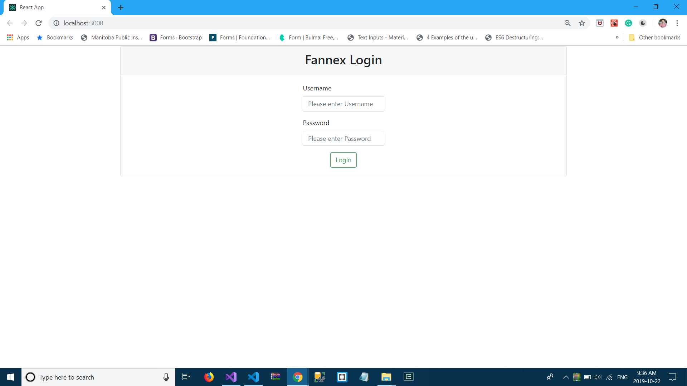
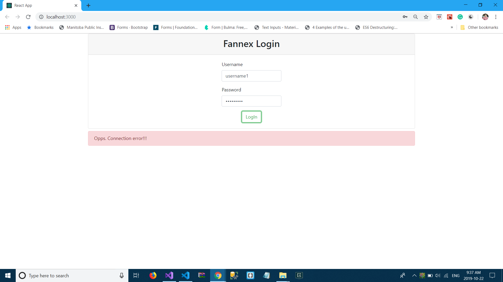
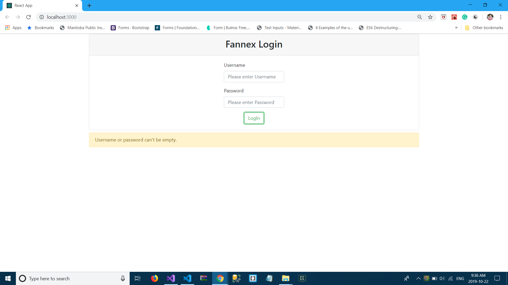

This project was bootstrapped with [Create React App](https://github.com/facebook/create-react-app).

## Available Scripts

In the project directory, you can run:

### `npm start`

Runs the app in the development mode. 
Open [http://localhost:3000](http://localhost:3000) to view it in the browser.

The page will reload if you make edits. 
You will also see any lint errors in the console.

### `Server run`
To create server go to this [Server Link](https://github.com/parth280197/FannexApi) and run it locally.

### `Screen-Shots`
1. Login

  
2. Server connection error

  
3. Empty input

  
  
4. Successful login

  
